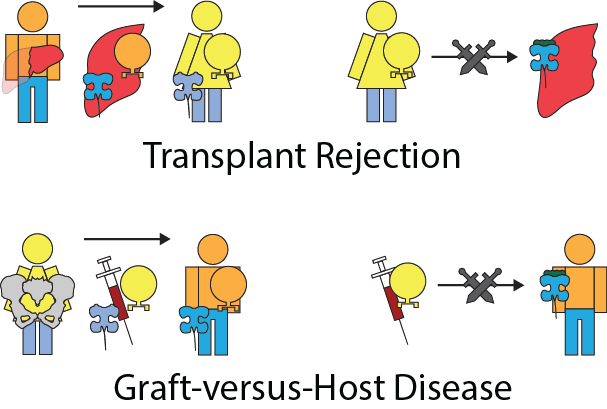

```{r global_options, include=FALSE}
library(knitr)
knitr::opts_chunk$set(echo = FALSE, message = FALSE, warning = FALSE)
```

# Human Leukocyte Antigens

Imagine you are sick with the flu. That means there are flu viruses growing in some of your cells. How does your immune system know to eliminate these infected cells but not the healthy ones? 

The obvious difference between an infected cell and a healthy cell is that there are lots of viral or bacterial proteins being made in them. But it's probably not a great idea to physically probe into each of your cells for its contents, since that would be really destructive. Fortunately, almost all of the cells in our body are equipped with proteins called Human Leukocyte Antigens (HLA). HLAs function as "windows" to a cell. Shortly after being made, they pick up peptides, or broken down protein fragments, randomly floating in the cell's free space. Then, the HLA move out to the cell surface to display the peptide to other neighboring cells. In this way, other cells can sample the contents of a neighboring cell without disturbing it. 

<center>

</center>

Leukocytes, the cells of our immune system that eliminate infected cells, use the peptides presented by HLA to determine whether a cell is sick or healthy. During a leukocyte's development, it is trained to recognize the collection of peptides, or peptidome, of healthy cells and to not attack them. So, when a cell is infected with a virus and begins replicating inside it, the cell's HLA will randomly pick up some of the foreing viral protein peptides and present them to a leukocyte. The leukocyte will not recognize the peptide, so it will by default trigger the destruction of the infected cell. 

From an evolutionary perspective, it is in the best interest of viruses and bacteria to make sure they don't produce any proteins that include peptide fragments that can be captured by HLA. Similarly, it is in the best interest of humans to develop as many variations of HLA as possible to capture all potential viral and bacterial peptides. As a result, the genes that create HLA are considered to be the most varied segments of DNA in all of the human genome - there are over 10,000 alleles, or DNA sequence variations, for genes encoding HLA, each with different peptidomes that they can capture. 

Additionally, this powerful and evolutionarily honed defense mechanism is a major cause for a problem in modern medicine: organ transplantation. Because of the immense variety of HLA, any two people are likely to have different HLA and HLA peptidomes. However, each person's leukocytes are trained on their own HLA peptidomes. When cells meet leukocytes trained on different HLA meet, they may end up attacking each other. 

As an example consider two people, Andrew and Beatrice, who have slightly different HLA. Andrew's HLA recognizes 3 different peptides. Beatrice has a slightly different looking HLA that can only pick up two different peptides. Andrew's and Beatrice's leukocytes therefore have been trained to recognize those three and two peptides respectively. 

<center>

</center>

If Andrew were to donate his liver to Beatrice, the HLA on the liver cells may present peptides that Beatrice's lymphocytes would not recognize. Therefore, Beatrice's leukocytes would attack the donated liver, causing transplant rejection. 

On the other hand, consider the case where Beatrice donates her bone marrow to Andrew. While most organs don't contain a significant number of leukocytes, bone marrow contains stem cells which perpetually generate leukocytes. These newly transplanted leukocytes will sometimes not recognize the presented peptides of the cells of the host. Beatrice's leukocytes in the donated bone marrow can then attack Andrew, causing graft-versus-host disease (GvHD). 

<center>

</center>

Based on these two major roles that HLA play in our health, a predictor algorithm to assess whether a peptide could be picked up by an HLA would have many uses. An epidemiologist could use the protein sequences of a virus predicted to become an epidemic against specific HLAs to see what ethnic communities are more likely to be affected based on the frequencies of their HLA. A doctor could check all of the HLA peptidome from a heart donor against that of the recipient to gauge the likelihood of transplant rejection, as well as to determine the extent to which immunosuppresant drugs should be used to sufficiently suppress the host's immune system from attacking the heart. 

Recent advancements in mass spectrometry have allowed us to sequence small peptide fragments, such as those bound to HLA. Experiments involving engineered cell lines with only one type of HLA present now allow us to sample the peptide binding preferences of any specific HLA. These peptidome datasets can help us prepare for epidemics caused by infectious diseases, and better match compatible organ donors and recipients. 
