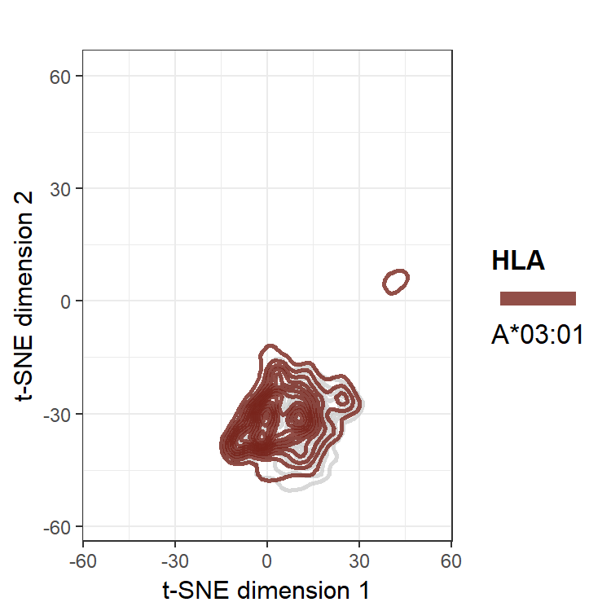
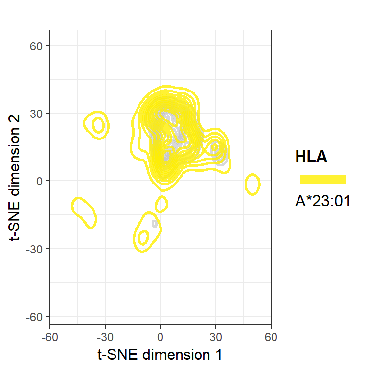

```{r global_options, include=FALSE}
library(knitr)
knitr::opts_chunk$set(echo = FALSE, message = FALSE, warning = FALSE)
```

## A Case for t-SNE 

t-distribution stochastic neighbor embedding (t-SNE) is a dimension reduction method that relies on an objective function. It can be considered an alternative to principal components analysis (PCA) in that they can both create two-dimensional plots that provide an intuitive understanding of the feature space in a dataset. However, there are advantages and disadvantages to the two methods. 

t-SNE can tease out nonlinear relations of features, unlike PCA. It also encompasses all information from all eigenvectors onto a lesser dimensional plot, whereas PCA must choose among the most impactful eigenvectors and disregard the others. Because the feature preferences are nonlinear (e.g. the HLA's peptide binding cleft requires an amino acid that is neither too small to be loose nor too large to not fit) and because PCA does not yield a dramatic shoulder in plots of total variance explained by its eigenvectors for our datasets, t-SNE was chosen for this analysis. 

However, it is important to be aware of the disadvantages to using t-SNE. t-SNE relies on minimizing an objective function such that iterations of the t-SNE using the same data and parameters will create (slightly) different results each time. Unlike PCA, t-SNE does not create loading matrix, and so plotting new points using the same transformations as a previously run t-SNE is unfeasible. Distances are arbitrary in a t-SNE plot, and so if the distance between two points A and B is half that of A and a point C, it does not nessarily follow that A and B are more similar than A and C. 

## Data Visualization Using t-SNE

The plots below are the results for t-SNE on the full dataset of 207 features for just HLA-A peptidomes. The plot on the left are points plotted with the colors as assigned from the Wasserstein heatmaps. The plot on the right is the same data, but smoothed into densities with two-dimensional kernel density estimation. 


<center>

</center>

The peptides for the individual HLA peptidomes are also shown in the following animated plots. 

```{r echo=FALSE, out.width='25%'}

knitr::include_graphics('./images/hlaa.a2.gif')

knitr::include_graphics('./images/hlaa.a4.gif')
```

These t-SNE plots give a good sense of the separability of the clusters. As we saw with the previous Wasserstein metric heatmaps, cluster A-I is the most unique, as it has the widest margin between it and the other clusters. The individual plots also corroborate that cluster A-II is a loose clustering, relative to the tightly knit A-III cluster. While t-SNE plots give an organic intuition about what the data looks like, for more concrete pairwise metrics among HLA peptidomes, the Wasserstein heatmaps are more useful. 
